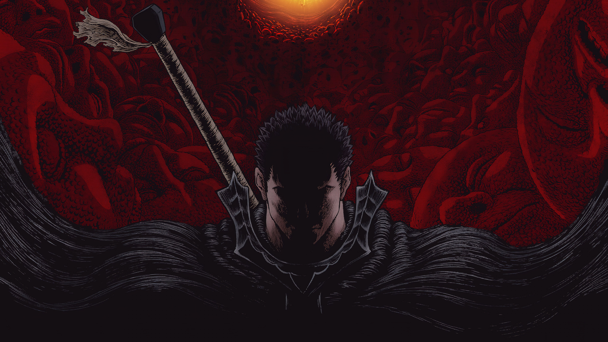

# Login Page (Berserk Style)

This is a simple login page with a dark anime-inspired background (Berserk), built using **HTML & CSS** only.

## 🎨 Features
- Glassmorphism design using `backdrop-filter`
- Fixed anime background image
- Hover animations
- Responsive design (partially)

## 📷 Screenshot

## 🚀 Live Demo
You can view the project [here](https://github.com/Aissa-cha/Login-page-) (

## 🛠️ Tech Used
- HTML5
- CSS3 (Flexbox, backdrop-filter)

## 📬 Feedback
If you have suggestions or improvements, feel free to open an issue or pull request.
